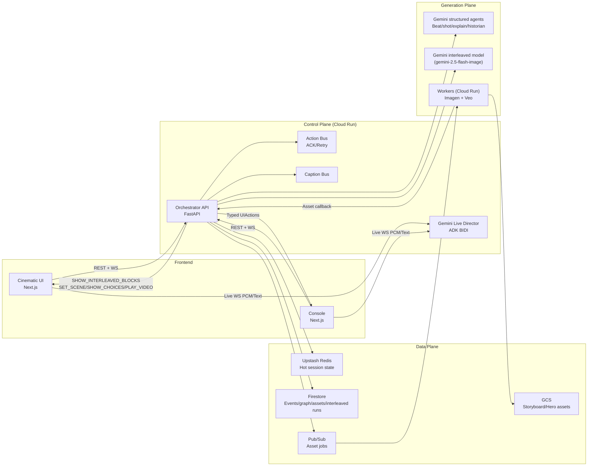

# WhatIf Cloud Architecture Diagram

```mermaid
flowchart LR
  subgraph FE["Frontend"]
    CUI["Cinematic UI\nNext.js"]
    CONS["Console\nNext.js"]
  end

  subgraph ORCH["Control Plane (Cloud Run)"]
    API["Orchestrator API\nFastAPI"]
    LIVE["Gemini Live Director\nADK BIDI"]
    ACT["Action Bus\nACK/Retry"]
    CAP["Caption Bus"]
  end

  subgraph DATA["Data Plane"]
    REDIS["Upstash Redis\nHot session state"]
    FS["Firestore\nEvents/graph/assets/interleaved runs"]
    PUB["Pub/Sub\nAsset jobs"]
    GCS["GCS\nStoryboard/Hero assets"]
  end

  subgraph GEN["Generation Plane"]
    GEM["Gemini structured agents\nBeat/shot/explain/historian"]
    ILV["Gemini interleaved model\n(gemini-2.5-flash-image)"]
    WRK["Workers (Cloud Run)\nImagen + Veo"]
  end

  CUI -->|REST + WS| API
  CONS -->|REST + WS| API
  CUI -->|Live WS PCM/Text| LIVE
  CONS -->|Live WS PCM/Text| LIVE

  API --> ACT
  API --> CAP
  API --> REDIS
  API --> FS

  API --> GEM
  API --> ILV

  API --> PUB
  PUB --> WRK
  WRK --> GCS
  WRK -->|Asset callback| API

  API -->|SHOW_INTERLEAVED_BLOCKS\nSET_SCENE/SHOW_CHOICES/PLAY_VIDEO| CUI
  API -->|Typed UIActions| CONS
```
